# 项目标题:电子法棒-卷积神经网络轨迹识别
[TOC]

基于STM32部署卷积神经网络控制设备方案-AI项目-STM32部署卷积神经网络方案-红外信号复制方案-轨迹识别

先了解一下背景，STM32是一款微**控制器**，做AI一般都是拥有算力的微处理器，量产非常昂贵，但是此项目解决微控制器能部署AI 卷积神经网络的技术，并且调研过目前位于深圳等一线城市，也有对**控制器**部署AI的客户需求，市场量很大。

项目包含下述内容

- 硬件部分、PCB制板、BOM表文件等等 (**Hardware**)
- 软件程序、用于电子法棒的软件程序 AI + Keil等等(**Software**)
- QT上位机动作识别模型训练脚本 （用于训练模型等功能）（**Upper_computer**）
- 图示、Demo中的12个动作轨迹图例(**Model_trajectories**)
- 二次开发方案

# 1.项目简介

**设备会根据你的手势轨迹动作，去发出指令，控制设备。可以理解是一个哈利波特魔法棒。**

1.设备的手势可以自行添加，目前13个手势，你可以任意添加你想要的手势轨迹，配备QT上位机给你添加（还可以学到QT）

2.设备会根据你做的动作判断是否正确，是否是动作集里面的动作，去发出控制设备的信号，比如空调的开关，温度的升降，任何牌子的都可以（格力美的等等都可以 本质是复制红外信号 调研过开源案例没有此方法）

# 2.系统架构

**硬件架构：**STM32F103、MPU6050、红外传感器、电池降压电路、电源管理IC、电源选择电路、充电管理电路、充电管理IC等等

**软件架构：**QT、ARM、Tensorflow、Keras、实战算法、nnom（嵌入式AI推理库）等等

# 3.项目资源包整体介绍

| 名称               | 作用                                                   |
| ------------------ | ------------------------------------------------------ |
| assets             | 项目说明文档图片资源                                   |
| hardware           | PCB                                                    |
| Model_trajectories | 产品手势运动轨迹图示                                   |
| NNOM_Demo          | 基本工程案例，可以衍生做出你自己的AI产品，眼球追踪等等 |
| Software           | 软件程序工程                                           |
| Upper_computer     | QT上位机，训练模型，数据收集                           |
| README.md          | 项目文稿内容                                           |

# 4.开发环境配置说明

**Keil环境配置：**

- Keil 版本：请使用 Keil 5，建议从 Keil 官网下载最新版，避免遇到兼容性问题。
- 编译器版本：请选择 Arm Compiler 6.22 作为编译器，确保项目能够顺利编译。
- 调试器设置：根据您的设备选择合适的调试器，例如 ST-Link 或其他兼容设备，以进行程序调试。

# 5.功能使用说明

**总体逻辑功能说明如下：**

- 系统启动与模式切换
  - 主板上电后默认进入 **模式0**。
  - **长按按钮0.5秒后松开**，系统切换至 **模式1**。
  - **长按松开**：按住按钮超过0.5秒后松开，用于模式切换。
  - **短按松开**：按住按钮小于0.5秒后松开，用于执行特定操作。

- 动作识别操作
  - 在任何模式下，**短按按钮并松开**将触发 **IMU传感器**的1.5秒采样，采集到的数据将输入至模型中进行 **动作识别**。
- 红外模块发送指令以及读取指令的模式功能
  - **模式0**：在得到动作识别输出后，模块根据识别的动作发送对应的 **预录制红外信号**。
  - **模式1**：在得到动作识别输出后，模块根据识别的动作 **等待并录制红外信号**。
- Type-C接口功能
  - **串口调试**：用于设备调试。
  - **电池充电**：当连接Type-C时，设备将使用 **Type-C电源** 而非电池供电。
- 电源开关
  - **电源开关** 控制设备的3.3V供电。
  - 在未开启电源开关时，电池可以进行充电，但 **STM32、IMU等设备不会上电工作**。

- LED状态指示灯
  - 按钮前的 **LED** 用于指示系统状态，有五种状态：
    - 10Hz闪烁
    - 5Hz闪烁
    - 2Hz闪烁
    - 常亮
    - 熄灭
- 按键-状态机

**如何调试**

**1.数据流模式（用来获取设备的运动轨迹信息）**

下述的宏定义在使用的情况，就是获取数据流的模式

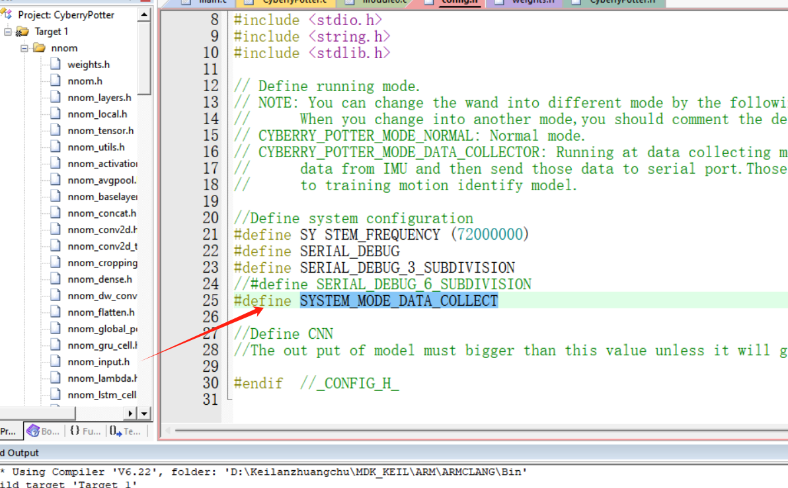 

我们可以在串口调试工具观察信息，只要按下按键开始做动作，就有数据流显示，
也就是我后文提到的章节 ”训练模型-训练自己想要的模型“

**2.使用模式，标准模式**

只需要我们把此宏定义注释，即可进入标准模式，使用模式

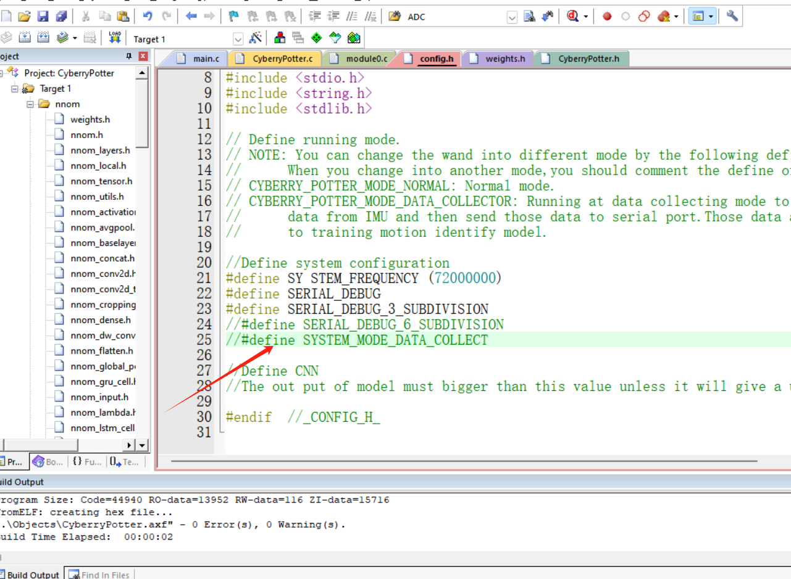 

还是打开串口调试助手，按下按键做动作，观察打印信息，可以从大模型推理识别手势动作，

# 6.二次开发方案

- 基于项目工程
  - .\电子法棒\Software\Module 此路径为二次开发模块 你想设计的功能只需要对应写入模块即可
  - 比如蓝牙 wifi等等各种拓展模块都可以~
  - 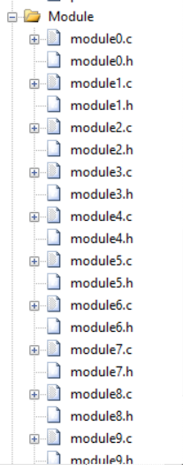 
  - 并位于.\电子法棒\Software\MainBoard\CyberryPotter.c 中进行增改枚举变量即可
  - 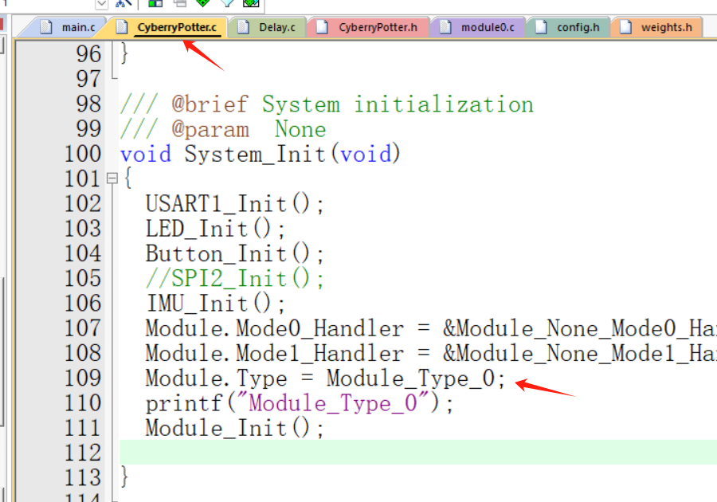 

- 基于卷积神经网络框架 NNOM_Demo 此项目已经移植好框架内容 本质就是训练模型然后量化推理的过程
  - 眼球追踪 Eye Tracking
    - 使用卷积神经网络对眼睛图像进行检测，定位瞳孔位置
  - 姿态估计 Pose Estimation
    - 利用摄像头或IMU传感器，实时检测人体的姿态，并基于CNN进行分类和估计。可用于运动分析、健康监测等场景

​	通过这些扩展方案，项目可以覆盖更多的应用场景，进一步提升智能化和交互性，特别是在嵌入式设备的实际应用中

例如 射频模块 wifi 蓝牙等等  同样可以进行插桩二次开发在设备上

# 7.训练模型-训练自己想要的轨迹

**.\电子法棒\Model_trajectories**

这是原本已经训练好的运动轨迹模型图

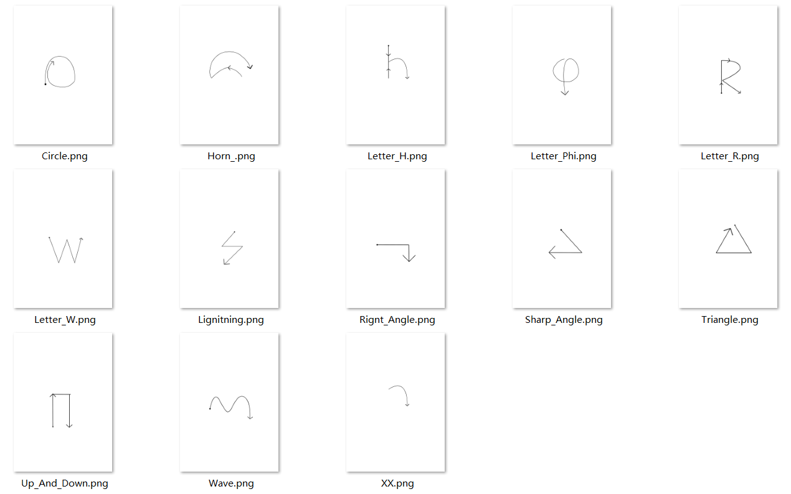

**.\电子法棒\Upper_computer\Acceptance_of_data\Acceptance_of_data.exe** 

此QT上位机作用是收集法棒运动轨迹的作用，你可以做出你自己想要的动作轨迹

方法如下：

1.先去工程把 #define SYSTEM_MODE_DATA_COLLECT 的注释取消，重新编译

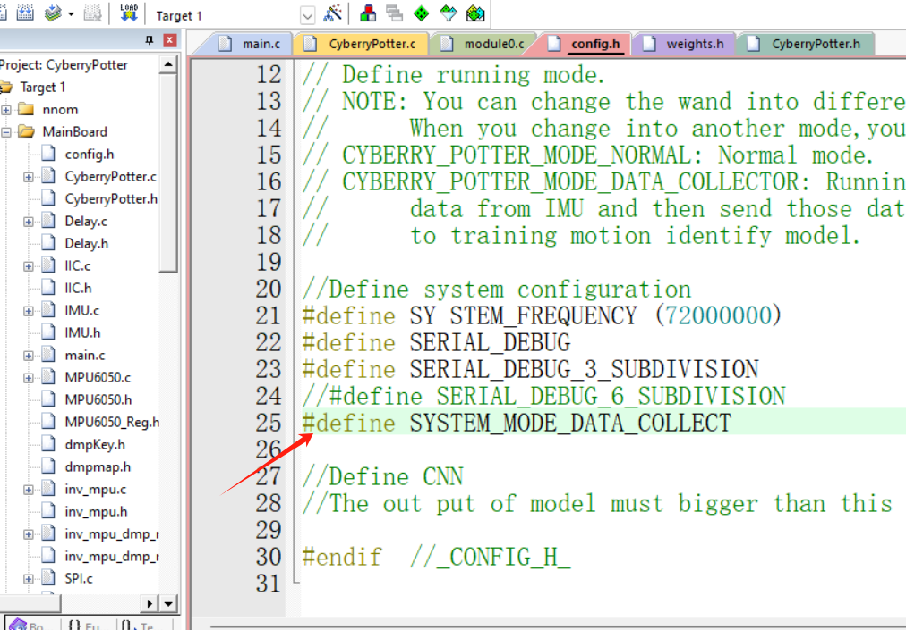 

2.设备插上串口 打开Acceptance_of_data.exe 进行运动轨迹数据收集 **选好串口** com口

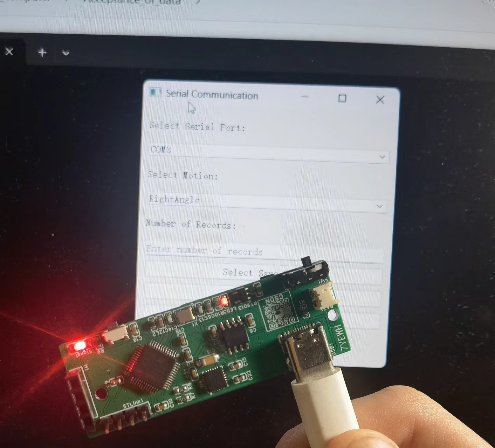

3.选择你想要的运动轨迹 运功轨迹可以做你自己想做的 也可以重新训练原本的 原本的轨迹图像位于
	.\电子法棒\Model_trajectories中

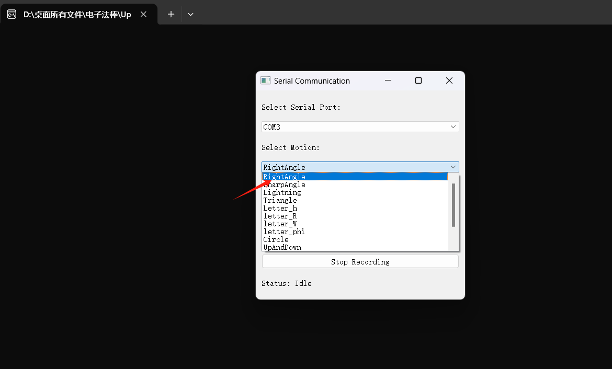

4.选择训练的次数 我这里为10组 最好多几十组

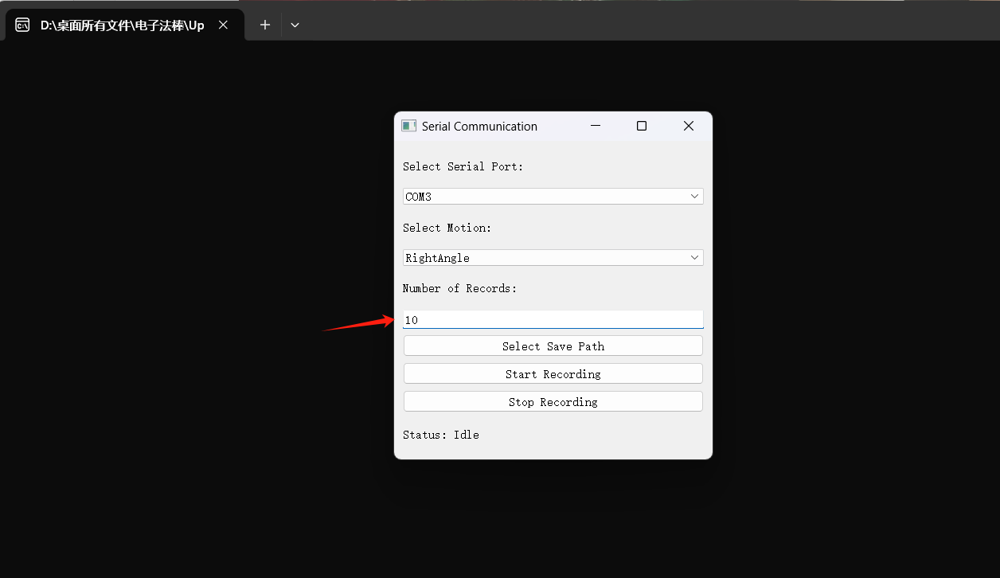

5.选好路径 最好不要有中文 用来存数据文件 命名好文件名

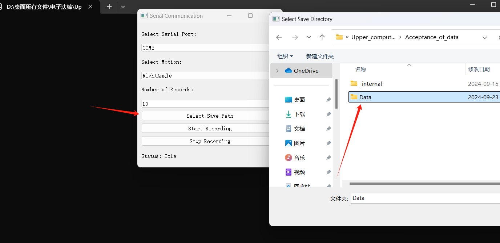

6.点击Start Recording

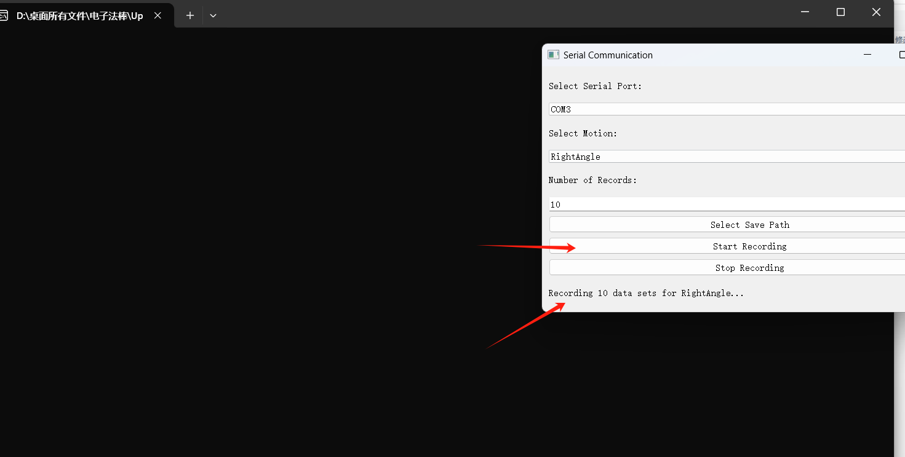

7.目前已经处于就绪状态，按下设备按键，开始录制动作，如下动态图所示。
（按下按键，即刻作出动作，我这边做的是 .\电子法棒\Model_trajectories\Rignt_Angle.png的动作，你也可以做你自己想录制的动作，新的任何动作） 

8.如此反复之后，得到下述数据，这些就是动作轨迹获取的数据。

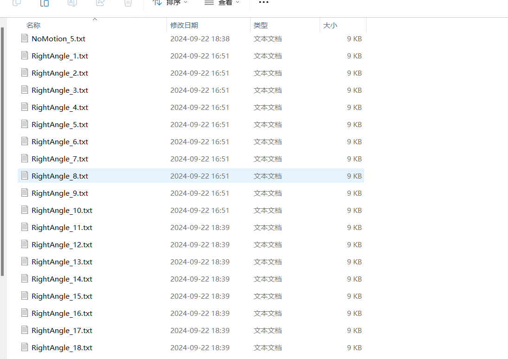 

**.\电子法棒\Upper_computer\Train_model\Train_model.exe **

1.打开此exe应用程序，点击 “选择数据文件夹即可”，这里是上述收集到轨迹数据的文件夹

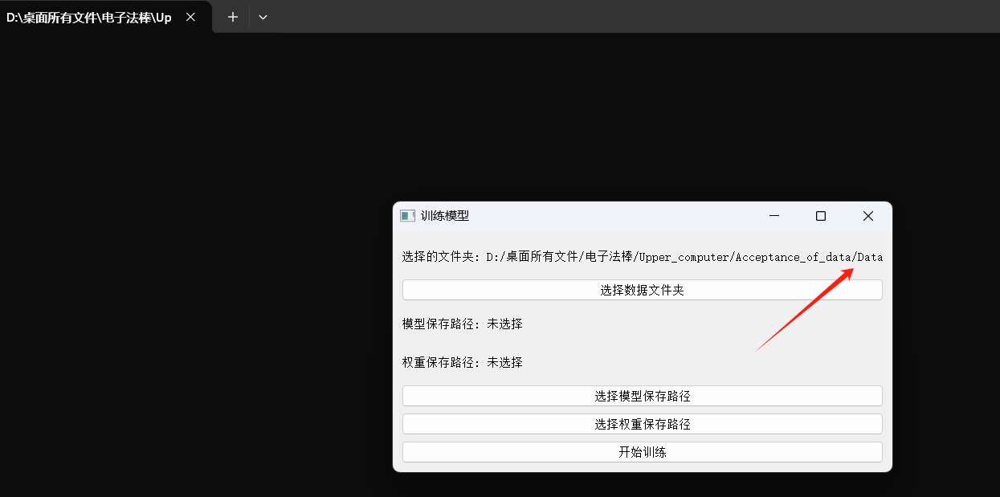 

2.依次点击“选择模型保存路径”和“选择权重保存路径” ，任意位置都可以，只要你知道在哪

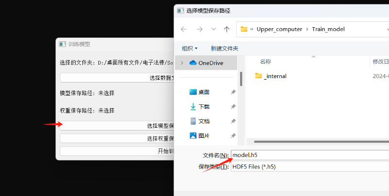 

3.一切都准备就绪，点击开始训练

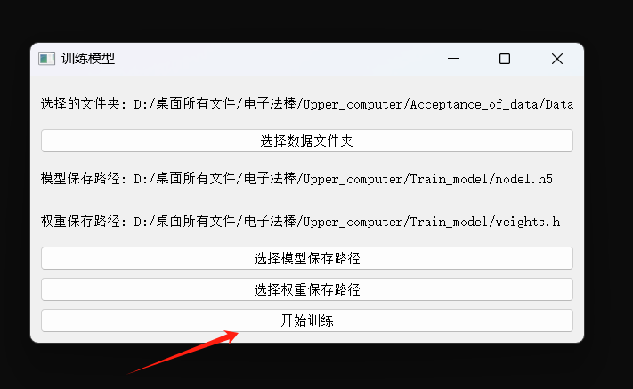 

（注意 路径不要有中文！！！！！ 我这里是错误演示！！！！！！）

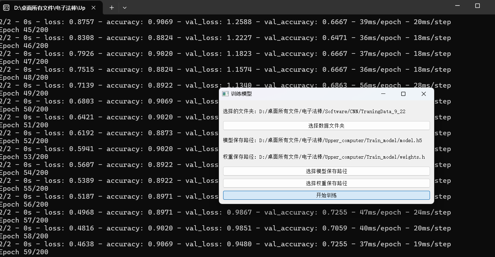 

4.完成界面如下，各个模型如图所示。

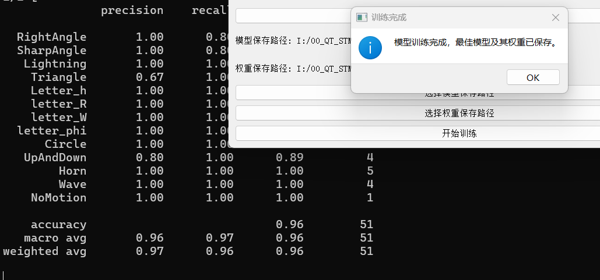 

5.最终生成的weights.h   放入.\电子法棒\Software\CNN\ 即可 替换原本的weights.h

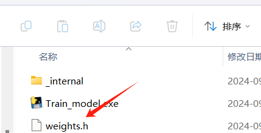 

其实也就是替换此文件~

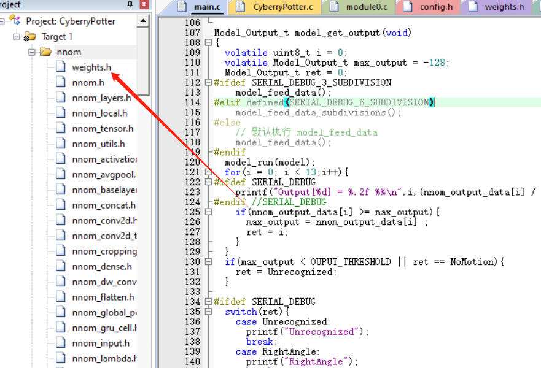 

# 8. NNOM

NNOM 是一个轻量级的、专为嵌入式设备设计的神经网络库，特别适用于 **ARM Cortex-M** 等资源有限的微控制器（MCU）。它的主要功能是将深度学习模型（如卷积神经网络，CNN）在低功耗、内存受限的嵌入式环境中进行推理（inference）让嵌入式系统能够执行机器学习任务，尤其是涉及神经网络的推理过程。

轻量化：NNOM 被设计为非常轻量的库，适合在内存和处理能力有限的嵌入式设备上运行，尤其是那些没有硬件加速器的设备。

跨平台：主要针对 Cortex-M 系列的处理器设计，但也可以在其他平台上移植使用。它依赖 CMSIS-NN，后者提供了一些优化的神经网络运算加速。

支持模型量化：NNOM 支持量化的神经网络模型，这在嵌入式设备上非常重要，因为量化模型可以大大减少内存和计算需求，适合资源受限的环境。

兼容性：NNOM 可以与 TensorFlow 和 Keras 等主流深度学习框架进行兼容，通过模型转换工具可以将训练好的模型转换成适合嵌入式系统使用的格式。

灵活性：NNOM 支持多种网络结构和层，如卷积层（Conv）、池化层（Pooling）、全连接层（Fully Connected）、激活函数（Activation）等，用户可以根据需要设计不同的网络架构。

开源和可定制：NNOM 是开源的，可以根据具体应用进行定制和修改。
[GitHub - majianjia/nnom: A higher-level Neural Network library for microcontrollers.](https://github.com/majianjia/nnom)

- 这里主要用来提供进行模型推理的库函数。
- 与主板交互：nnom 与主板部分紧密交互，主板会负责采集传感器数据并传递给 nnom，nnom 在推理完成后将结果反馈给主板进行后续的控制操作。
- 神经网络推理：nnom 部分是基于 NNOM 框架的神经网络推理模块。它负责将训练好的神经网络模型加载到嵌入式系统中，并进行实时推理操作。
- 动作或模式识别：如果项目涉及动作识别或分类（基于 IMU 传感器的数据），nnom 部分会根据采集到的数据进行推理，输出识别结果。推理过程使用预先训练并量化的卷积神经网络（CNN）模型。
- 模型处理：nnom 部分也可能包含一些用于管理神经网络模型的代码，例如加载模型、管理内存、进行推理的优化操作（如 CMSIS-NN 加速）。

MainBoard：

- 这里为主要产品的主逻辑框架实现。
- 协议类驱动
- IMU驱动等等相关外设驱动 
- 系统控制，负责整体系统的主控逻辑，处理应用层的主要功能，如数据采集、通信控制、模式切换等。
- 系统初始化

Module：

- 红外模块：负责红外信号的发送和接收，可能会根据 nnom 的推理结果进行控制。
- 通信模块：如果项目中有无线通信功能（如蓝牙、Wi-Fi、LoRa），这些模块会负责与外部设备通信，传输数据或接收命令等等，二次开发

# 9.常见错误问题汇总

1.当我们编译时.\电子法棒\Software\CyberryPotter.uvprojx，会发生下述报错

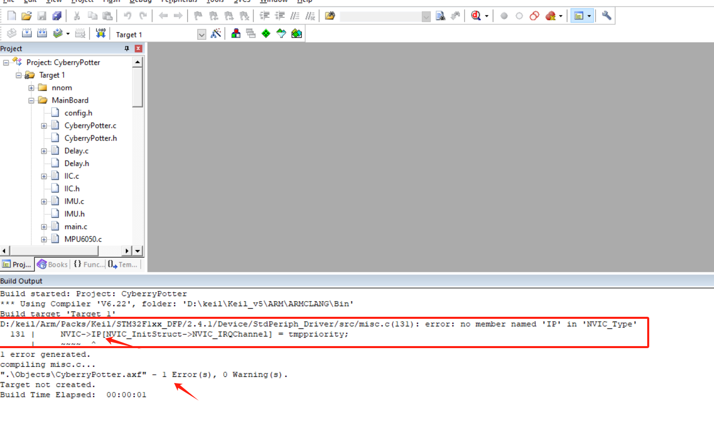

追溯到报错信息后，发现是这里的misc.c的问题

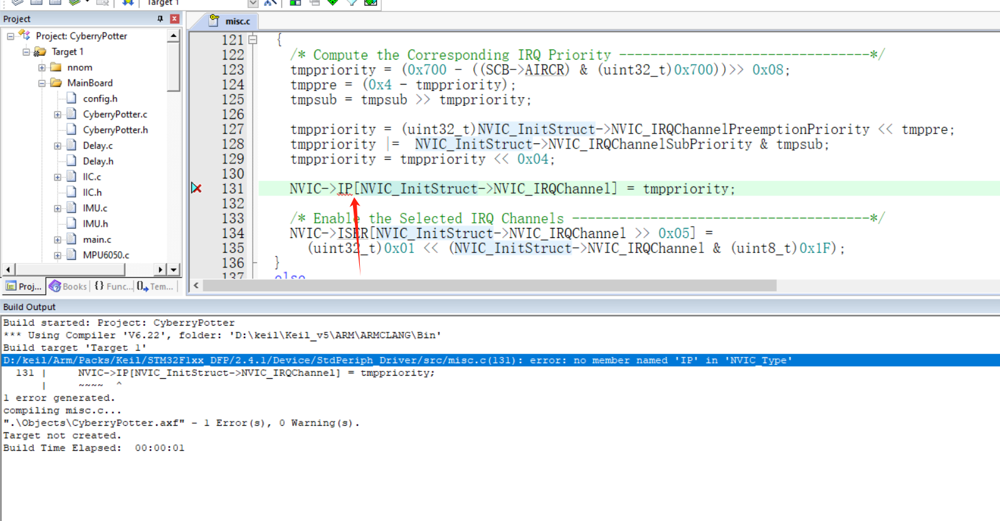

只要修改上述内容即可，但是文件是只读的，要去修改文件属性，跟着报错路径去找。

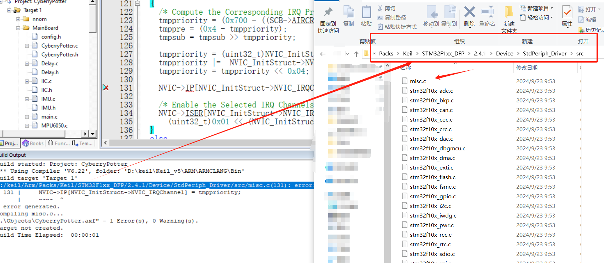

然后右键文件点击属性，把勾去掉即可。

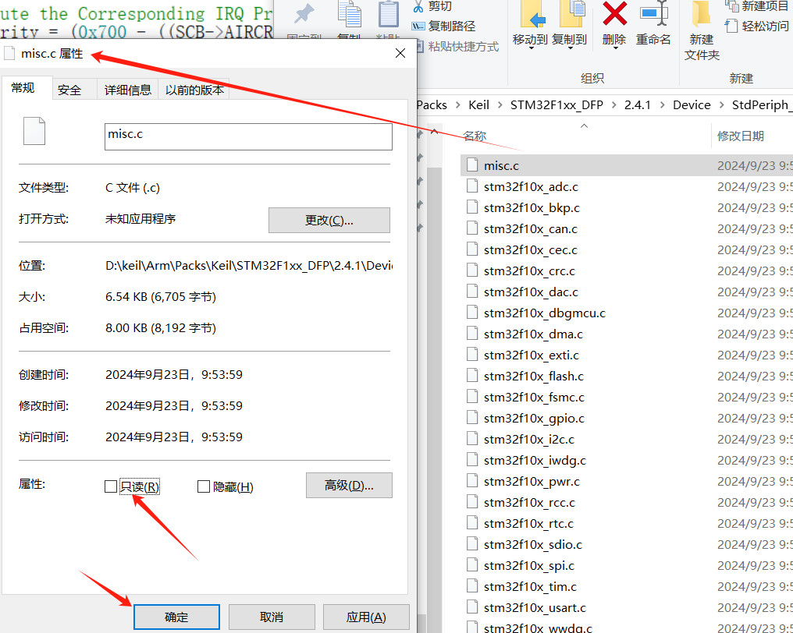

然后编译，0报错，0警告。

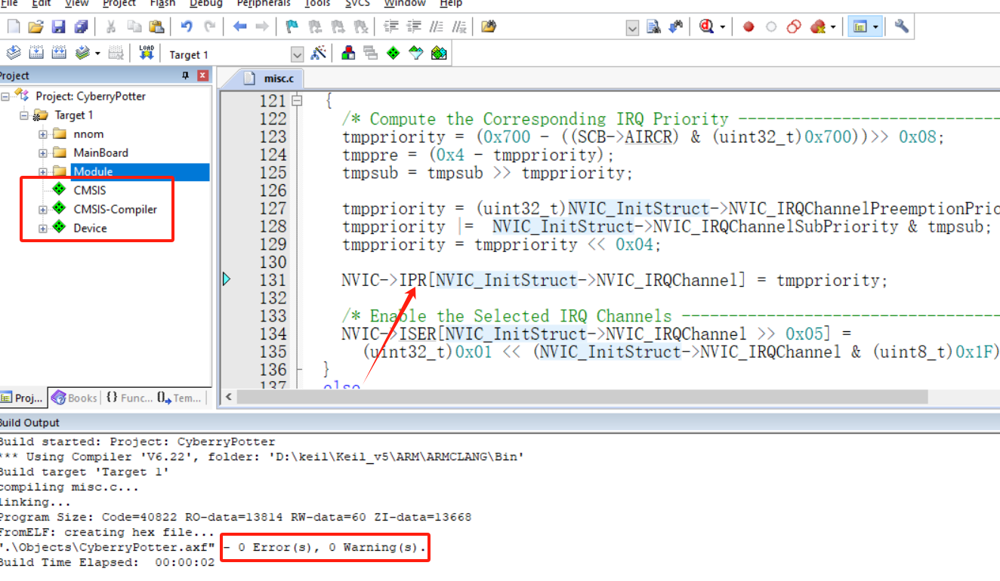

2.训练模型报错 

- 重试几次 试试  
- 都是全部手势里面都必须有数据源才行  也就是文件夹每个手势轨迹都有才可以训练

