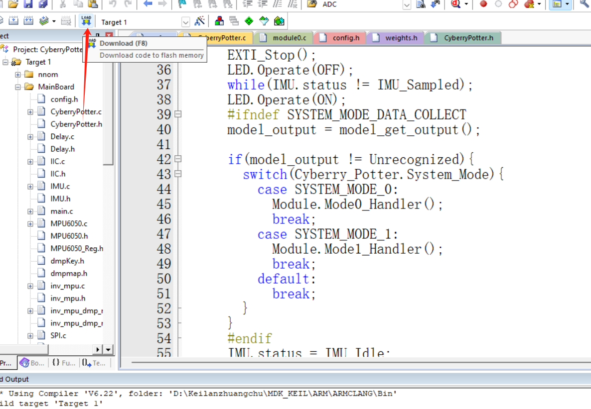

# 项目标题-电子法棒-卷积神经网络轨迹识别方案

基于STM32部署卷积神经网络控制设备方案-AI项目-STM32部署卷积神经网络方案-红外信号复制方案-轨迹识别

先了解一下背景，STM32是一款微**控制器**，做AI一般都是拥有算力的微处理器，量产非常昂贵，但是此项目解决微控制器能部署AI 卷积神经网络的技术，并且调研过目前位于深圳等一线城市，也有对**控制器**部署AI的客户需求，市场量很大。

项目包含下述内容

- 硬件部分、PCB制板、BOM表文件等等 (**Hardware**)
- 外壳、3D打印文件、如果你有想法也可以告诉我、帮你设计~ (**3D_print**)
- 软件程序、用于电子法棒的软件程序 AI + Keil等等(**Software**)
- QT上位机动作识别模型训练脚本 （用于训练模型等功能）（**Upper_computer**）
- 图示、Demo中的12个动作轨迹图例(**Model_trajectories**)
- 环境安装包、工具包(Install_package) + 嵌入式神经网络部署源码(NNOM_Demo)
- 二次开发方案
- 技术支持、全项目内容答疑
- 项目持续更新中（**任何问题和想法 功能都可以跟我提，我会慢慢跟进解决**）

[TOC]

# 1.项目简介

**目的：**不管是学习还是面试过程中，项目比重的占比都是绝对性的，没有好的项目是无法入行的，非常多的人来找我要新颖的项目。经调研，发现项目如此重要，很多人的简历无非就是小车跟智能家居，我看了近千份简历，大家都是雷同的培训班之类的项目，没有任务意义。也去展会看过，甚至培训班也都是小车以及智能家居套壳，硬件卖的贵，扩展性也没有。

解决痛点：（经调研）

- 市场需求在变，客户方案也在变，AI结合嵌入式是主流，需更迭新鲜的血液，这是你要与老工程师拉开的路径

- 市面上无案例，不同于市面上小车，智能家居等等一味堆叠传感器的方案培训班项目，写简历都是大同小异！

- 市面上针对嵌入式AI项目案例几乎没有，都是人脸识别等类型的项目大同小异，此项目方案为此打破常规 直接在最低成本的stm32运行卷积神经网络！
- 项目可以二次开发，模块化架构编程思维，不同于培训班以及市面项目，可以迭代成自己的产品，不像别的项目学了自己也无法迭代。
- 即使你是业内人员你也无法感受到整个产品流程，项目从硬件到软件到上位机到外壳设计一整套流程，让你明白业务流程与工程流程，正真设计产品的流程。

**功能：**（通俗易懂）

​		**设备会根据你的手势轨迹动作，去发出指令，控制设备。你可以理解是一个哈利波特魔法棒。**

1.设备的手势可以自行添加，目前13个手势，你可以任意添加你想要的手势轨迹，配备QT上位机给你添加（还可以学到QT）

2.设备会根据你做的动作判断是否正确，是否是动作集里面的动作，去发出控制设备的信号，比如空调的开关，温度的升降，任何牌子的都可以（格力美的等等都可以 本质是复制红外信号 调研过开源案例没有此方法）

**本质是STM32部署卷积神经网络**方案，如果学以致用，你也可以做出眼球跟踪项目等等，本质都是一样的方案~


# 2.系统架构

**硬件架构：**STM32F103、MPU6050、红外传感器、电池降压电路、电源管理IC、电源选择电路、充电管理电路、充电管理IC等等

**软件架构：**QT、ARM、Tensorflow、Keras、实战算法、nnom（嵌入式AI推理库）等等


# 3.项目资源包整体介绍

| 名称               | 作用                                                   |
| ------------------ | ------------------------------------------------------ |
| 3D_print           | 产品外壳，3D打印工程文件，持续更新                     |
| assets             | 项目说明文档图片资源                                   |
| hardware           | PCB、BOM表、原理图、嘉立创工程                         |
| Install_package    | 环境安装包、工具包                                     |
| Model_trajectories | 产品手势运动轨迹图示                                   |
| NNOM_Demo          | 基本工程案例，可以衍生做出你自己的AI产品，眼球追踪等等 |
| Software           | 软件程序工程                                           |
| Upper_computer     | QT上位机，训练模型，数据收发                           |
| README.md          | 项目文稿内容                                           |

 


# 4.开发环境配置说明

**Keil环境配置：**

- Keil 版本：请使用 Keil 5，建议从 Keil 官网下载最新版，避免遇到兼容性问题。

- 编译器版本：请选择 Arm Compiler 6.22 作为编译器，确保项目能够顺利编译。

- 调试器设置：根据您的设备选择合适的调试器，例如 ST-Link 或其他兼容设备，以进行程序调试。

- 库文件安装：首次打开项目时，Keil 可能提示需要安装缺失的库，请根据提示进行安装，以确保项目能够正常运行。

环境配置手把手教程如下（你真的不会我也可以远程帮你~）


# 5.安装与配置（手把手）

最新的keil我已经放在Install_package中，(keil 安装包) keygen.exe(密钥软件)

**步骤如下：**

1.点击MDK540.exe，勾选，点击Next。

 

2.继续Next

 

3.安装的路径path可以改一下，我这里改到D盘，继续Next。

 

4.这里随便填就好了，点击Next。

 

5.这里就一直等待就好了，安装完毕。

 

7.管理员身份运行 桌面的Keil uVision5，默认可能会安装一些资源包，等待就行，有进度条提示。

 


过程中如果有提示相关安装页面提示，都点击next或者install就好了。


8.安装完毕之后，点击左上角的 File 点击License Management... 这里要开始破解软件了。。。

CID填到Install_package目录下，keygen.exe(密钥软件)中的那栏，生成码填入左侧，点击 Add Lic即可。


9.当我们编译时.\电子法棒\Software\CyberryPotter.uvprojx，会发生下述报错


追溯到报错信息后，发现是这里的misc.c的问题


只要修改上述内容即可，但是文件是只读的，要去修改文件属性，跟着报错路径去找。


然后右键文件点击属性，把勾去掉即可。


然后编译，0报错，0警告。


# 6.功能使用说明（必看） *

**总体逻辑功能说明如下：**

- 系统启动与模式切换
  - 主板上电后默认进入 **模式0**。
  - **长按按钮0.5秒后松开**，系统切换至 **模式1**。
  - **长按松开**：按住按钮超过0.5秒后松开，用于模式切换。
  - **短按松开**：按住按钮小于0.5秒后松开，用于执行特定操作。

- 动作识别操作
  - 在任何模式下，**短按按钮并松开**将触发 **IMU传感器**的1.5秒采样，采集到的数据将输入至模型中进行 **动作识别**。
- 红外模块发送指令以及读取指令的模式功能
  - **模式0**：在得到动作识别输出后，模块根据识别的动作发送对应的 **预录制红外信号**。
  - **模式1**：在得到动作识别输出后，模块根据识别的动作 **等待并录制红外信号**。
- Type-C接口功能
  - **串口调试**：用于设备调试。
  - **电池充电**：当连接Type-C时，设备将使用 **Type-C电源** 而非电池供电。
- 电源开关
  - **电源开关** 控制设备的3.3V供电。
  - 在未开启电源开关时，电池可以进行充电，但 **STM32、IMU等设备不会上电工作**。

- LED状态指示灯
  - 按钮前的 **LED** 用于指示系统状态，有五种状态：
    - 10Hz闪烁
    - 5Hz闪烁
    - 2Hz闪烁
    - 常亮
    - 熄灭
- 按键-状态机


**如何烧写？**

1. 位于.\电子法棒\Software\CyberryPotter.uvprojx 打开工程文件 先编译 后点击2处

 

2.点击后如图所示，选择你自己合适的烧写器用来烧写，我这里用的是STLINK

 

3.确定后点击Download，烧录程序进板端

 

如下为实物连接图

 


**如何调试？**

**1.数据流模式（用来获取设备的运动轨迹信息）**

下述的宏定义在使用的情况，就是获取数据流的模式

 

我们可以在串口调试工具观察信息，只要你按下按键开始做动作，就有数据流显示，
也就是我后文提到的章节 ”训练模型-训练自己想要的模型“

下图是我按下按键后随机做的动作，可以观察灯的变化情况。


**2.使用模式，标准模式**

只需要我们把此宏定义注释，即可进入标准模式，使用模式

 

还是打开串口调试助手，按下按键做动作，观察打印信息，可以从大模型推理识别手势动作，

我这里就随便做了几个动作，按下按键为开始做一个动作。识别功能都是完美正常的！


**如果我使用的是面包板？**

找到 .\电子法棒\Install_package\weights\Component_plates\weights.h 替换原本keil工程中的weights.h即可


PA1 	led

PA2	RX2（预留红外口）

PA3	TX2（预留红外口）

PA0 	button

PA9	  TX

PA10	RX	

PB7	SDA

PB6 	SCL

PB5	INT

其实就是原理图上面的接线 看着接好就行了


# 7.二次开发方案

- 基于项目工程
  - .\电子法棒\Software\Module 此路径为二次开发模块 你想设计的功能只需要对应写入模块即可
  - 比如蓝牙 wifi等等各种拓展模块都可以~
  -  
  - 并位于.\电子法棒\Software\MainBoard\CyberryPotter.c 中进行增改枚举变量即可
  -  

- 基于卷积神经网络框架 NNOM_Demo 此项目已经移植好框架内容 本质就是训练模型然后量化推理的过程
  - 眼球追踪 Eye Tracking
    - 使用卷积神经网络对眼睛图像进行检测，定位瞳孔位置
  - 姿态估计 Pose Estimation
    - 利用摄像头或IMU传感器，实时检测人体的姿态，并基于CNN进行分类和估计。可用于运动分析、健康监测等场景

​	通过这些扩展方案，项目可以覆盖更多的应用场景，进一步提升智能化和交互性，特别是在嵌入式设备的实际应用中


例如 射频模块 wifi 蓝牙等等  同样可以进行插桩二次开发在设备上

 


# 8.训练模型-训练自己想要的轨迹

**.\电子法棒\Model_trajectories**

这是原本已经训练好的运动轨迹模型图


**.\电子法棒\Upper_computer\Acceptance_of_data\Acceptance_of_data.exe** 

此QT上位机作用是收集法棒运动轨迹的作用，你可以做出你自己想要的动作轨迹

方法如下：

1.先去工程把 #define SYSTEM_MODE_DATA_COLLECT 的注释取消，重新编译

 

2.设备插上串口 打开Acceptance_of_data.exe 进行运动轨迹数据收集 **选好串口** com口


3.选择你想要的运动轨迹 运功轨迹可以做你自己想做的 也可以重新训练原本的 原本的轨迹图像位于
	.\电子法棒\Model_trajectories中


4.选择训练的次数 我这里为10组 最好多几十组


5.选好路径 最好不要有中文 用来存数据文件 命名好文件名


6.点击Start Recording


7.目前已经处于就绪状态，按下设备按键，开始录制动作，如下动态图所示。
（按下按键，即刻作出动作，我这边做的是 .\电子法棒\Model_trajectories\Rignt_Angle.png的动作，你也可以做你自己想录制的动作，新的任何动作）

 

8.如此反复之后，得到下述数据，这些就是动作轨迹获取的数据。

 


**.\电子法棒\Upper_computer\Train_model\Train_model.exe **

1.打开此exe应用程序，点击 “选择数据文件夹即可”，这里是上述收集到轨迹数据的文件夹

 

2.依次点击“选择模型保存路径”和“选择权重保存路径” ，任意位置都可以，只要你知道在哪

 

3.一切都准备就绪，点击开始训练

 

（注意 路径不要有中文！！！！！ 我这里是错误演示！！！！！！）

 

4.完成界面如下，各个模型如图所示。

 

5.最终生成的weights.h   放入.\电子法棒\Software\CNN\ 即可 替换原本的weights.h

 

其实也就是替换此文件~

 


# 9.软件部分-从0到1源码详解

**.\电子法棒\Software\CyberryPotter.uvprojx 利用keil打开即可**

1.代码总体结构如下所示：

 

nnom：

NNOM 是一个轻量级的、专为嵌入式设备设计的神经网络库，特别适用于 **ARM Cortex-M** 等资源有限的微控制器（MCU）。它的主要功能是将深度学习模型（如卷积神经网络，CNN）在低功耗、内存受限的嵌入式环境中进行推理（inference）让嵌入式系统能够执行机器学习任务，尤其是涉及神经网络的推理过程。

轻量化：NNOM 被设计为非常轻量的库，适合在内存和处理能力有限的嵌入式设备上运行，尤其是那些没有硬件加速器的设备。

跨平台：主要针对 Cortex-M 系列的处理器设计，但也可以在其他平台上移植使用。它依赖 CMSIS-NN，后者提供了一些优化的神经网络运算加速。

支持模型量化：NNOM 支持量化的神经网络模型，这在嵌入式设备上非常重要，因为量化模型可以大大减少内存和计算需求，适合资源受限的环境。

兼容性：NNOM 可以与 TensorFlow 和 Keras 等主流深度学习框架进行兼容，通过模型转换工具可以将训练好的模型转换成适合嵌入式系统使用的格式。

灵活性：NNOM 支持多种网络结构和层，如卷积层（Conv）、池化层（Pooling）、全连接层（Fully Connected）、激活函数（Activation）等，用户可以根据需要设计不同的网络架构。

开源和可定制：NNOM 是开源的，可以根据具体应用进行定制和修改。
[GitHub - majianjia/nnom: A higher-level Neural Network library for microcontrollers.](https://github.com/majianjia/nnom)

- 这里主要用来提供进行模型推理的库函数。
- 与主板交互：nnom 与主板部分紧密交互，主板会负责采集传感器数据并传递给 nnom，nnom 在推理完成后将结果反馈给主板进行后续的控制操作。
- 神经网络推理：nnom 部分是基于 NNOM 框架的神经网络推理模块。它负责将训练好的神经网络模型加载到嵌入式系统中，并进行实时推理操作。
- 动作或模式识别：如果项目涉及动作识别或分类（基于 IMU 传感器的数据），nnom 部分会根据采集到的数据进行推理，输出识别结果。推理过程使用预先训练并量化的卷积神经网络（CNN）模型。
- 模型处理：nnom 部分也可能包含一些用于管理神经网络模型的代码，例如加载模型、管理内存、进行推理的优化操作（如 CMSIS-NN 加速）。

MainBoard：

- 这里为主要产品的主逻辑框架实现。
- 协议类驱动
- IMU驱动等等相关外设驱动 
- 系统控制，负责整体系统的主控逻辑，处理应用层的主要功能，如数据采集、通信控制、模式切换等。
- 系统初始化

Module：

- 红外模块：负责红外信号的发送和接收，可能会根据 nnom 的推理结果进行控制。
- 通信模块：如果项目中有无线通信功能（如蓝牙、Wi-Fi、LoRa），这些模块会负责与外部设备通信，传输数据或接收命令等等，二次开发


分析main.c

```c
#include "CyberryPotter.h"		//系统相关的功能 包含中断等
#include "weights.h" 			//神经网络模型的权重文件
#include "nnom.h"				//负责神经网络推理的具体操作。

//输入数据进行量化处理
#define QUANTIFICATION_SCALE (pow(2,INPUT_1_OUTPUT_DEC))
//推理的输出阈值
#define OUPUT_THRESHOLD 63 

void model_feed_data(void);
void model_feed_data_subdivisions(void);
Model_Output_t model_get_output(void);

#ifdef NNOM_USING_STATIC_MEMORY
	uint8_t static_buf[1024 * 10]; 
#endif //NNOM_USING_STATIC_MEMORY
nnom_model_t* model;

//神经网络推理的输出结果
volatile Model_Output_t model_output = -1;

int main(void)
{       
	// 初始化整个系统，包括外设的配置和状态设置
	System_Init();
    //控制LED灯以10Hz频率闪烁，表示系统正在启动或初始化中。
	LED.Operate(BLINK_10HZ);
    
	//创建CNN模型
	#ifdef NNOM_USING_STATIC_MEMORY
    //设置静态内存缓冲区
    //创建一个CNN模型实例（假设这是使用nnom库的模型，通常用于神经网络推理任务）
		nnom_set_static_buf(static_buf, sizeof(static_buf)); 
	#endif
    
    //创建一个 nnom 的 CNN 模型，初始化神经网络用于推理任务。
	model = nnom_model_create();
	
	printf("While");
	while(1){
		//当检测到按钮处于保持状态（BUTTON_HOLD）且IMU处于空闲状态时，执行后续操作。
		if(Button.status == BUTTON_HOLD && IMU.status == IMU_Idle){
            //IMU数据采集
			IMU.Sample_Start();					//启动IMU数据采集。
			EXTI_Stop();						//停止外部中断
			LED.Operate(OFF);
			while(IMU.status != IMU_Sampled);	//等待IMU数据采集完成。
			LED.Operate(ON);
            
			#ifndef SYSTEM_MODE_DATA_COLLECT
			model_output = model_get_output();			//将IMU采集到的数据输入CNN模型进行推理
			
			if(model_output != Unrecognized){			//未识别到任何动作 Unrecognized 
            //根据当前的System_Mode执行不同的操作函数，Mode0_Handler()和Mode1_Handler()分别是模式0和模式1下的处理函数
				switch(Cyberry_Potter.System_Mode){		
					case SYSTEM_MODE_0:
						Module.Mode0_Handler();
						break;
					case SYSTEM_MODE_1:
						Module.Mode1_Handler();
						break;
					default:
						break;
				}
			}
			#endif
            //重置IMU状态为IMU_Idle，表示数据采集完成。
            //清除按钮状态，并恢复外部中断（EXTI_Restore()），让系统回到正常的中断处理状态。
			IMU.status = IMU_Idle;
			Button.status_clear();
			EXTI_Restore();
		}
        //如果检测到按钮长按状态（BUTTON_HOLD_LONG），系统进入长按处理逻辑：
		else if(Button.status == BUTTON_HOLD_LONG){
            //如果检测到按钮长按状态（BUTTON_HOLD_LONG），系统进入长按处理逻辑：
			printf("BUTTON_HOLD_LONG\n");
			LED.Operate(BLINK_5HZ);
			Cyberry_Potter_System_Status_Update();
			#ifdef LASER_ENABLE
            //可选功能
			if(Cyberry_Potter.System_Mode == SYSTEM_MODE_2){
				Laser.status = ON;
				Laser.Operate(Laser.status);
			}
			else{
				Laser.status = OFF;
				Laser.Operate(Laser.status);
			}
			#endif
            //清除按钮状态
			Button.status_clear();
		}
	}
}

//3维数据
#ifdef SERIAL_DEBUG_3_SUBDIVISION
void model_feed_data(void) 
{
	const double scale = QUANTIFICATION_SCALE;
	uint16_t i = 0;
	for(i = 0; i < IMU_SEQUENCE_LENGTH_MAX;i++){
		nnom_input_data[i*3] = (int8_t)round(IMU.gyro[i][Roll] * scale);
		nnom_input_data[i*3+1] = (int8_t)round(IMU.gyro[i][Pitch] * scale);
		nnom_input_data[i*3+2] = (int8_t)round(IMU.gyro[i][Yaw] * scale);
	}
}
/*
量化：通过scale对数据进行缩放并转换为整型
作用：读取IMU的陀螺仪数据（Roll、Pitch、Yaw），通过量化缩放（QUANTIFICATION_SCALE）将浮点数转换为8位整数，并填充到输入数组nnom_input_data中。
每次循环：处理一组陀螺仪数据（即一个时刻的Roll、Pitch、Yaw三个轴数据），将其量化后存储到模型的输入数组中。
*/
#endif

//6组数据
#ifdef SERIAL_DEBUG_6_SUBDIVISION
void model_feed_data1(void)
{
	const double scale = QUANTIFICATION_SCALE;
	uint16_t i = 0;
	for(i = 0; i < IMU_SEQUENCE_LENGTH_MAX;i++){
		nnom_input_data[i*6] = 	 (int8_t)round(IMU.acc[i][AccX] * scale);
		nnom_input_data[i*6+1] = (int8_t)round(IMU.acc[i][AccY] * scale);
		nnom_input_data[i*6+2] = (int8_t)round(IMU.acc[i][AccZ] * scale);
		nnom_input_data[i*6+3] = (int8_t)round(IMU.gyro[i][Roll] * scale);
		nnom_input_data[i*6+4] = (int8_t)round(IMU.gyro[i][Pitch] * scale);
		nnom_input_data[i*6+5] = (int8_t)round(IMU.gyro[i][Yaw] * scale);
	}
}
//每次循环采集6个数值，分别是3个加速度计数据和3个陀螺仪数据，并依次填充到nnom_input_data中。
#endif

Model_Output_t model_get_output(void)
{
	volatile uint8_t i = 0;
	volatile Model_Output_t max_output = -128; 	//用于记录推理结果中最大的输出值
	Model_Output_t ret = 0; 					//用于存储模型最终的分类结果。
    
    //选择执行3维数据输入或6维数据输入的函数。如果没有定义，默认执行model_feed_data函数。
#ifdef SERIAL_DEBUG_3_SUBDIVISION
    model_feed_data();
#elif defined(SERIAL_DEBUG_6_SUBDIVISION)
    model_feed_data_subdivisions();
#else
    // 默认执行 model_feed_data
    model_feed_data();
#endif
    
    //执行神经网络模型的推理，模型推理结果会被存储在nnom_output_data数组中，该数组的每个元素代表不同类别的预测分数。
	model_run(model);
    
    //遍历所有类别（共13类），找到预测得分最高的类别，并将对应的索引i作为模型的输出结果存入ret。
	for(i = 0; i < 13;i++){
#ifdef SERIAL_DEBUG
		printf("Output[%d] = %.2f %%\n",i,(nnom_output_data[i] / 127.0)*100);
#endif //SERIAL_DEBUG
		if(nnom_output_data[i] >= max_output){
			max_output = nnom_output_data[i] ;
			ret = i;
		}
	}
    //如果最大输出值低于设定的阈值（OUPUT_THRESHOLD）或者预测结果为NoMotion（未检测到动作），则将模型结果设为Unrecognized（未识别）。
	if(max_output < OUPUT_THRESHOLD || ret == NoMotion){
		ret = Unrecognized;
	}
	
#ifdef SERIAL_DEBUG
	switch(ret){
		case Unrecognized:
			printf("Unrecognized");
			break;
		case RightAngle:
			printf("RightAngle");
			break;
		case SharpAngle:
			printf("SharpAngle");
			break;
		case Lightning:
			printf("Lightning");
			break;
		case Triangle:
			printf("Triangle");
			break;
		case Letter_h:
			printf("Letter_h");
			break;
		case letter_R:
			printf("Letter_R");
			break;
		case letter_W:
			printf("Letter_W");
			break;
		case letter_phi:
			printf("Letter_phi");
			break;
		case Circle:
			printf("Circle");
			break;
		case UpAndDown:
			printf("UpAndDown");
			break;
		case Horn:
			printf("Horn");
			break;
		case Wave:
			printf("Wave");
			break;
		case NoMotion:
			printf("Unrecognized");
			break;
	}
	printf("\n");
#endif //SERIAL_DEBUG
	return ret;
}

```


分析CyberryPotter.c

```c
#include "CyberryPotter.h"

extern struct IMU_t IMU;
extern struct LED_t LED;
Cyberry_Potter_t Cyberry_Potter;
Module_t Module;


//这是两个回调函数 灯闪烁的频率
void Module_None_Mode0_Handler(void)
{
	LED.Operate(BLINK_10HZ);
}
void Module_None_Mode1_Handler(void)
{
	LED.Operate(BLINK_5HZ);
}

/*
Module_Init() 函数负责初始化不同的模块，依据 Module.Type 类型选择对应的初始化函数（例如，Module0_Init() 到 Module10_Init()）。这些初始化函数中，还为模块设置了模式 0 和模式 1 的回调处理函数。
如果模块类型是 Module_Type_None，则会默认使用 Module_None_Mode0_Handler 和 Module_None_Mode1_Handler 作为回调。
*/
void Module_Init(void)
{
	switch (Module.Type) {
		case Module_Type_None:
			Module.Mode0_Handler = &Module_None_Mode0_Handler;
			Module.Mode1_Handler = &Module_None_Mode1_Handler;
			break;
		case Module_Type_0:
			Module0_Init();
			printf("Module Module_Type_0 Init\n");
			Module.Mode0_Handler = &Module0_Mode0_Handler;
			Module.Mode1_Handler = &Module0_Mode1_Handler;
			break;
		case Module_Type_1:
			Module1_Init();
			printf("Module %d Init\n",Module.Type);
			Module.Mode0_Handler = &Module1_Mode0_Handler;
			Module.Mode1_Handler = &Module1_Mode1_Handler;
			break;
		case Module_Type_2:
			Module2_Init();
			printf("Module %d Init\n",Module.Type);
			Module.Mode0_Handler = &Module2_Mode0_Handler;
			Module.Mode1_Handler = &Module2_Mode1_Handler;
			break;
		case Module_Type_3:
			Module3_Init();
			printf("Module %d Init\n",Module.Type);
			Module.Mode0_Handler = &Module3_Mode0_Handler;
			Module.Mode1_Handler = &Module3_Mode1_Handler;
			break;
		case Module_Type_4:
			Module4_Init();
			printf("Module %d Init\n",Module.Type);
			Module.Mode0_Handler = &Module4_Mode0_Handler;
			Module.Mode1_Handler = &Module4_Mode1_Handler;
			break;
		case Module_Type_5:
			Module5_Init();
			printf("Module %d Init\n",Module.Type);
			Module.Mode0_Handler = &Module5_Mode0_Handler;
			Module.Mode1_Handler = &Module5_Mode1_Handler;
			break;
		case Module_Type_6:
			Module6_Init();
			printf("Module %d Init\n",Module.Type);
			Module.Mode0_Handler = &Module6_Mode0_Handler;
			Module.Mode1_Handler = &Module6_Mode1_Handler;
			break;
		case Module_Type_7:
			Module7_Init();
			printf("Module %d Init\n",Module.Type);
			Module.Mode0_Handler = &Module7_Mode0_Handler;
			Module.Mode1_Handler = &Module7_Mode1_Handler;
			break;
		case Module_Type_8:
			Module8_Init();
			printf("Module %d Init\n",Module.Type);
			Module.Mode0_Handler = &Module8_Mode0_Handler;
			Module.Mode1_Handler = &Module8_Mode1_Handler;
			break;
		case Module_Type_9:
			Module9_Init();
			printf("Module %d Init\n",Module.Type);
			Module.Mode0_Handler = &Module9_Mode0_Handler;
			Module.Mode1_Handler = &Module9_Mode1_Handler;
			break;
		case Module_Type_10: 
			Module10_Init();
			printf("Module %d Init\n",Module.Type);
			Module.Mode0_Handler = &Module10_Mode0_Handler;
			Module.Mode1_Handler = &Module10_Mode1_Handler;
			break;
		default:
			break;
	}
}

/*
System_Init() 函数是整个系统初始化的入口。它负责初始化串口通信（USART1_Init()）、LED、按钮、IMU（惯性测量单元）等外设。
初始化后，默认会将 Module.Type 设为 Module_Type_0，并调用 Module_Init() 来初始化相应的模块。
最后设置模块的模式处理函数，初始为 Module_None_Mode0_Handler 和 Module_None_Mode1_Handler。
*/
void System_Init(void)
{
	USART1_Init();
	LED_Init();
  Button_Init();
	//SPI2_Init();
	IMU_Init();
	Module.Mode0_Handler = &Module_None_Mode0_Handler;
	Module.Mode1_Handler = &Module_None_Mode1_Handler;
	Module.Type = Module_Type_0;
	printf("Module_Type_0");
	Module_Init();

}

//按键模式切换  并且在调试模式下，会输出当前系统模式的状态。
void Cyberry_Potter_System_Status_Update(void)
{
      switch(Cyberry_Potter.System_Mode){
	      case SYSTEM_MODE_0:
			Cyberry_Potter.System_Mode = SYSTEM_MODE_1;
			#ifdef SERIAL_DEBUG
			printf("SYSTEM_MODE_1\n");
			#endif //SERIAL_DEBUG
			break;
	      case SYSTEM_MODE_1:
			#ifdef LASER_ENABLE
			Cyberry_Potter.System_Mode = SYSTEM_MODE_2;
			#else
			Cyberry_Potter.System_Mode = SYSTEM_MODE_0;
			#endif
			#ifdef SERIAL_DEBUG
			printf("SYSTEM_MODE_0\n");
			#endif //SERIAL_DEBUG
			break;
	      #ifdef LASER_ENABLE
	      case SYSTEM_MODE_2:
			Cyberry_Potter.System_Mode = SYSTEM_MODE_0;
			#ifdef SERIAL_DEBUG
			printf("SYSTEM_MODE_0\n");
			#endif //SERIAL_DEBUG
			break;
	      #endif
      }  
}


/*
是外部中断的处理函数，主要用于处理 EXTI 线路 5 的中断信号。当检测到该中断时，调用 IMU_Get_Data(i) 读取 IMU 数据。读取完成后，IMU 会停止采样，并清除中断标志位。
此外，函数中还实现了一个简单的采样控制逻辑，变量 i 用于记录采样次数，每当达到最大值 IMU_SEQUENCE_LENGTH_MAX 时，采样停止。
*/
void EXTI9_5_IRQHandler(void)
{
	static uint8_t i = 0;
	//IMU read
	if(EXTI_GetITStatus(EXTI_Line5)==SET){
		IMU_Get_Data(i);
		i++;
		if(i >= IMU_SEQUENCE_LENGTH_MAX){
			i = 0;
			//printf("Samlpled\n");
			IMU.Sample_Stop();
			#ifdef SYSTEM_MODE_DATA_COLLECT
			Delay_ms(200);
			IMU_Data_Print();
			#endif
		}	
		EXTI_ClearITPendingBit(EXTI_Line5);	
  }
}


//EXTI_Stop() 函数用于关闭 EXTI 线路 0 的中断响应，即暂时禁用该中断。
//EXTI_Restore() 函数则用于恢复 EXTI 线路 0 的中断响应，即重新启用中断。
void EXTI_Stop(void)
{
	EXTI->IMR &= ~(EXTI_Line0);
}
void EXTI_Restore(void)
{
	EXTI->IMR |= EXTI_Line0;
}
```


module0.c 红外解析

```c
#include "module0.h"
#include "new_study_IR.h"
#include "protocol.h"

extern volatile Model_Output_t model_output; 	//表示不同的模型识别结果
uint16_t bufLen;								//存储红外信号的打包数据长度
uint8_t buf[128], i;							//红外信号数据

// 定义模型名称
const char* model_names[] = {					//这些模型名称将用于后续打印和调试输出
    "RightAngle", "SharpAngle", "Lightning", "Triangle", 
    "Letter_h", "Letter_R", "Letter_W", "Letter_phi", 
    "Circle", "UpAndDown", "Horn", "Wave"
};

// 定义模型对应的索引值
const uint8_t model_indices[] = {				//在红外信号处理时，该索引值将决定信号的内容。
    0, 1, 2, 3, 4, 5, 6, 0, 0, 0, 1, 1
};
 
// 打印模型名称 确保 model 的值没有超过 model_names[] 数组的长度范围。如果模型有效，则打印其对应的名称
void print_model_name(Model_Output_t model) {
    if (model < sizeof(model_names) / sizeof(model_names[0])) {
        printf("%s", model_names[model]);
    } else {
        printf("Unrecognized Model");
    }
}

// 检查模型并返回结果 检查当前的 model_output（即模型输出值），并返回对应的模型。如果模型输出在 model_indices[] 数组范围内，则通过指针 model_index 返回对应的索引值。同时，调用 print_model_name() 函数打印模型名称。
Model_Output_t check_model(uint8_t* model_index) {
    Model_Output_t ret = model_output;
    
    if (ret < sizeof(model_indices) / sizeof(model_indices[0])) {
        *model_index = model_indices[ret];
    } else {
        ret = Unrecognized;
    }
    
    print_model_name(ret);
    return ret;
}

// 处理红外信号（发射或学习）
/*
函数负责根据当前模式（发射或学习）来处理红外信号：
首先调用 check_model() 函数检查当前模型，获取相应的 model_index。
如果模型有效，则根据 mode 选择不同的操作（IR_Send_Pack 或 IR_Learn_Pack）。
将打包好的数据通过 Uart_Send() 函数发送出去。
成功发送信号后，通过 LED.Operate() 让LED以5Hz频率闪烁，表示信号成功发送。如果模型无效，则LED以2Hz频率闪烁，表示错误。
*/
void handle_ir_signal(uint8_t mode) {
    uint8_t model_index;
    
    if (check_model(&model_index) != Unrecognized) {
				#ifdef SERIAL_DEBUG
				printf(" * %d * ", model_index);
				#endif //SERIAL_DEBUG
        bufLen = (mode == 0) ? IR_Send_Pack(buf, model_index) : IR_Learn_Pack(buf, model_index);
        Uart_Send(buf, bufLen);
        LED.Operate(BLINK_5HZ);
    } else {
        LED.Operate(BLINK_2HZ);
    }
}

// 初始化模块
void Module0_Init(void) {
    //Module0_Init() 函数负责初始化模块的串口配置，通过 USART2_Config() 函数设置串口参数，使能通信。
    USART2_Config();
}

// 模式0处理（红外发射） 模式0表示红外信号的发送。
void Module0_Mode0_Handler(void) {
    handle_ir_signal(0);
}

// 模式1处理（红外学习） 模式1表示红外信号的学习。
void Module0_Mode1_Handler(void) {
    handle_ir_signal(1);
}
```


# 10.QT上位机+AI部分-卷积神经网络详解

**.\电子法棒\Upper_computer\Acceptance_of_data\Acceptance_of_data.exe**

**.\电子法棒\Upper_computer\Train_model\Train_model.exe**

前者是运动轨迹数据采集QT上位机、后者是训练运动轨迹模型QT上位机


Acceptance_of_data.exe 运动轨迹数据采集QT上位机 解析如下

```python
import sys
import os
import re
import time
import serial
import serial.tools.list_ports
from PyQt5.QtWidgets import QApplication, QMainWindow, QVBoxLayout, QWidget, QPushButton, QComboBox, QLabel, QLineEdit, QMessageBox, QFileDialog
from PyQt5.QtCore import QThread, pyqtSignal, QTimer
from PyQt5.QtGui import QPalette, QColor

# Constants
DEF_TIME_FOR_NOW = time.localtime()
DEF_TIME_MONTH = str(DEF_TIME_FOR_NOW.tm_mon)
DEF_TIME_DAY = str(DEF_TIME_FOR_NOW.tm_mday)
DEF_FILE_NAME_SEPERATOR = '_'
DEF_FILE_FORMAT = '.txt'
DEF_TITLE_STRING = 'IMU\n'
DEF_BAUD_RATE = 921600

motion_name = ['RightAngle', 'SharpAngle', 'Lightning', 'Triangle', 'Letter_h', 'letter_R', 'letter_W', 'letter_phi', 'Circle', 'UpAndDown', 'Horn', 'Wave', 'NoMotion']

class SerialThread(QThread):
    received_data = pyqtSignal(str)
    finished = pyqtSignal()

    def __init__(self, port, baud_rate):
        super().__init__()
        self.port = port
        self.baud_rate = baud_rate
        self.running = True

    def run(self):
        with serial.Serial(port=self.port,
                           baudrate=self.baud_rate,
                           bytesize=serial.EIGHTBITS,
                           parity=serial.PARITY_NONE,
                           stopbits=serial.STOPBITS_ONE,
                           timeout=0.5) as ser:
            while self.running:
                received = ser.readall().decode("ASCII")
                if received:
                    self.received_data.emit(received)
        self.finished.emit()

    def stop(self):
        self.running = False

class MainWindow(QMainWindow):
    def __init__(self):
        super().__init__()

        self.serial_thread = None
        self.save_path = './TraningData' + DEF_FILE_NAME_SEPERATOR + DEF_TIME_MONTH + DEF_FILE_NAME_SEPERATOR + DEF_TIME_DAY + '/'
        self.setup_ui()

    def setup_ui(self):
        self.setWindowTitle("Serial Communication")
        self.setGeometry(100, 100, 400, 400)

        # Set background color and font color for the entire window
        palette = QPalette()
        palette.setColor(QPalette.Window, QColor(50, 50, 50))  # Dark background
        palette.setColor(QPalette.WindowText, QColor(255, 255, 255))  # White text
        self.setPalette(palette)

        # Styling the widgets
        style_sheet = """
            QLabel, QComboBox, QLineEdit, QPushButton {
                color: white;               /* Text color */
                background-color: #2E2E2E;  /* Background for combo box, buttons */
                border: 1px solid #FFFFFF;  /* White border */
                padding: 5px;
                font-size: 14px;
            }
            QPushButton:hover {
                background-color: #5E5E5E;  /* Button hover effect */
            }
        """
        self.setStyleSheet(style_sheet)

        central_widget = QWidget()
        layout = QVBoxLayout()

        self.port_combo = QComboBox()
        self.port_combo.addItems(self.get_ports())
        layout.addWidget(QLabel("Select Serial Port:"))
        layout.addWidget(self.port_combo)
        
        self.motion_combo = QComboBox()
        self.motion_combo.addItems(motion_name)
        layout.addWidget(QLabel("Select Motion:"))
        layout.addWidget(self.motion_combo)

        self.record_count_input = QLineEdit()
        self.record_count_input.setPlaceholderText("Enter number of records")
        layout.addWidget(QLabel("Number of Records:"))
        layout.addWidget(self.record_count_input)

        self.select_path_button = QPushButton("Select Save Path")
        self.select_path_button.clicked.connect(self.select_save_path)
        layout.addWidget(self.select_path_button)

        self.start_button = QPushButton("Start Recording")
        self.start_button.clicked.connect(self.start_recording)
        layout.addWidget(self.start_button)

        self.stop_button = QPushButton("Stop Recording")
        self.stop_button.clicked.connect(self.stop_recording)
        layout.addWidget(self.stop_button)

        self.status_label = QLabel("Status: Idle")
        layout.addWidget(self.status_label)

        self.setCentralWidget(central_widget)
        central_widget.setLayout(layout)

        self.timer = QTimer()
        self.timer.timeout.connect(self.check_data)

    def get_ports(self):
        port_list = list(serial.tools.list_ports.comports())
        return [port.device for port in port_list]

    def select_save_path(self):
        directory = QFileDialog.getExistingDirectory(self, "Select Save Directory", self.save_path)
        if directory:
            self.save_path = directory
            self.status_label.setText(f"Save path selected: {self.save_path}")

    def start_recording(self):
        if self.serial_thread is not None and self.serial_thread.isRunning():
            QMessageBox.warning(self, "Recording Error", "Recording is already in progress.")
            return

        port = self.port_combo.currentText()
        motion = self.motion_combo.currentText()
        try:
            count = int(self.record_count_input.text())
        except ValueError:
            QMessageBox.warning(self, "Input Error", "Please enter a valid number for records.")
            return

        if not os.path.exists(self.save_path):
            os.makedirs(self.save_path)

        self.status_label.setText(f"Recording {count} data sets for {motion}...")
        self.record_count = 0
        self.data_set_max = count
        self.motion_assigned = motion
        self.name_index = self.find_max_number_in_filenames(motion, self.save_path) + 1

        self.serial_thread = SerialThread(port, DEF_BAUD_RATE)
        self.serial_thread.received_data.connect(self.handle_data)
        self.serial_thread.finished.connect(self.recording_finished)
        self.serial_thread.start()

        self.timer.start(100)  # Check data every 100 ms

    def stop_recording(self):
        if self.serial_thread is not None:
            self.serial_thread.stop()
            self.serial_thread.wait()
            self.status_label.setText("Recording stopped.")
        self.timer.stop()

    def handle_data(self, received_string):
        if self.check_title(received_string):
            filename = os.path.join(self.save_path, self.motion_assigned + DEF_FILE_NAME_SEPERATOR + str(self.name_index) + DEF_FILE_FORMAT)
            with open(filename, "w") as file:
                file.write(self.imu_string(received_string))
            self.status_label.setText(f"Data saved as {filename}")
            self.record_count += 1
            self.name_index += 1

            if self.record_count >= self.data_set_max:
                self.stop_recording()

    def check_title(self, received_string):
        title_buffer = received_string.split('\n')[0] + '\n'
        return title_buffer == DEF_TITLE_STRING

    def imu_string(self, received_string):
        return received_string[len(DEF_TITLE_STRING):]

    def find_max_number_in_filenames(self, motion, folder_path):
        max_number = 0
        number_pattern = re.compile(r'\d+')
        matching_filenames = []

        for filename in os.listdir(folder_path):
            if motion in filename:
                matching_filenames.append(filename)

        for filename in matching_filenames:
            numbers = number_pattern.findall(filename)
            for num_str in numbers:
                num = int(num_str)
                if num > max_number:
                    max_number = num

        return max_number

    def check_data(self):
        # This function is called periodically to check for incoming data
        pass

    def recording_finished(self):
        self.status_label.setText("Recording completed.")
        self.timer.stop()

if __name__ == '__main__':
    app = QApplication(sys.argv)
    window = MainWindow()
    window.show()
    sys.exit(app.exec_())
```

- 常量定义：

  - DEF_TIME_FOR_NOW：当前时间，用于获取月和日信息。

  - DEF_TIME_MONTH 和 DEF_TIME_DAY：用于构建文件保存路径的时间信息。

  - DEF_FILE_NAME_SEPERATOR：文件名分隔符。

  - DEF_FILE_FORMAT：数据文件的格式（.txt）。

  - DEF_TITLE_STRING：串口数据开头的标题字符串，用于数据校验。

  - DEF_BAUD_RATE：串口通信的波特率，设置为921600。

  - motion_name：存储可选的动作名称，用户可以从中选择记录的动作类型。

- SerialThread 类：

  - 该类继承自 QThread，用于在独立线程中处理串口通信。

  - 通过 serial.Serial 连接指定的串口端口，使用指定的波特率接收数据。

  - received_data 信号：当有数据从串口接收时触发。

  - finished 信号：当线程结束时触发。

  - stop 方法：终止线程中的数据接收循环。

- MainWindow 类：

  - 该类继承自 QMainWindow，用于创建图形用户界面（GUI）。

  - setup_ui 方法：设置窗口的标题、大小、背景颜色和字体颜色，并创建各个控件，包括串口选择、动作选择、记录数量输入框、保存路径选择按钮、开始和停止录制按钮等。

  - get_ports 方法：使用 serial.tools.list_ports 列出所有可用的串口设备供用户选择。

  - select_save_path 方法：弹出文件对话框供用户选择数据保存目录。

  - start_recording 方法：开始记录 IMU 数据，初始化串口线程，并设置定时器周期性检查数据。

  - stop_recording 方法：停止记录，终止串口线程并停止定时器。

  - handle_data 方法：处理从串口接收到的数据，检查数据的标题是否合法，并将数据保存为文本文件。

  - check_title 方法：检查接收到的数据是否包含预期的标题字符串。

  - imu_string 方法：提取并返回除去标题后的 IMU 数据。

  - find_max_number_in_filenames 方法：在保存文件的目录中查找指定动作的文件，并找出文件名中最大的数字，确保新文件的命名不会冲突。

  - check_data 方法：用于定时检查串口数据，当前为空函数，供将来扩展。

用户启动程序后，界面上会显示串口选择、动作类型选择、数据记录数量输入框等控件。

用户选择串口、动作类型，并设定记录数量和保存路径，点击“开始录制”按钮后，程序会启动串口通信，并开始接收 IMU 数据。

接收到的数据将按指定格式保存到文本文件中，文件名中包含动作名称和递增的编号。

当记录的数量达到用户设定值或用户手动停止录制时，程序终止录制并关闭串口。


Train_model.exe 训练运动轨迹模型QT上位机 解析如下

```python
import sys
import os
import numpy as np
import tensorflow as tf
from tensorflow.keras import layers, models, optimizers, losses, callbacks, utils  # type: ignore TensorFlow
from tensorflow.keras.preprocessing.sequence import pad_sequences  # type: ignore TensorFlow
from sklearn.metrics import classification_report
from PyQt5.QtWidgets import QApplication, QMainWindow, QFileDialog, QPushButton, QLabel, QVBoxLayout, QWidget, QMessageBox
import re

# 动作分类名
motion_names = [
    'RightAngle', 'SharpAngle', 'Lightning', 'Triangle', 'Letter_h', 'letter_R', 
    'letter_W', 'letter_phi', 'Circle', 'UpAndDown', 'Horn', 'Wave', 'NoMotion'
]

# 定义目录路径和文件名
DEF_MODEL_NAME = 'model.h5'
DEF_WEIGHTS_NAME = 'weights.h'
DEF_FILE_MAX = 100
DEF_N_ROWS = 150
DEF_COLUMNS = (3, 4, 5)
DEF_FILE_FORMAT = '.txt'
DEF_FILE_NAME_SEPERATOR = '_'
DEF_BATCH_SIZE = 120
DEF_NUM_EPOCH = 200

# 动作名称到标签的映射
motion_to_label = {name: idx for idx, name in enumerate(motion_names)}

# 定义训练函数
def train(x_train, y_train, x_test, y_test, model_path, weights_path, 
          input_shape=(DEF_N_ROWS, 3, 1), num_classes=len(motion_names), 
          batch_size=DEF_BATCH_SIZE, epochs=DEF_NUM_EPOCH):
    
    inputs = layers.Input(shape=input_shape)
    x = layers.Conv2D(30, kernel_size=(3, 3), strides=(3, 1), padding='same')(inputs)
    x = layers.LeakyReLU()(x)
    x = layers.Conv2D(15, kernel_size=(3, 3), strides=(3, 1), padding='same')(x)
    x = layers.LeakyReLU()(x)
    x = layers.AveragePooling2D(pool_size=(3, 1), strides=(3, 1))(x)
    x = layers.Flatten()(x)
    x = layers.Dense(num_classes)(x)
    outputs = layers.Softmax()(x)
    
    model = models.Model(inputs=inputs, outputs=outputs)
    model.compile(optimizer=optimizers.Adam(), loss=losses.CategoricalCrossentropy(), metrics=['accuracy'])
    
    early_stopping = callbacks.EarlyStopping(monitor='val_loss', patience=10)
    checkpoint = callbacks.ModelCheckpoint(model_path, monitor='val_accuracy', save_best_only=True, mode='max')
    
    history = model.fit(x_train, y_train, batch_size=batch_size, epochs=epochs, verbose=2, 
                        validation_data=(x_test, y_test), shuffle=True, 
                        callbacks=[early_stopping, checkpoint])
    
    # Save the model weights
    model.save_weights(weights_path)
    
    del model
    tf.keras.backend.clear_session()
    
    return history

# 加载数据集函数
def load_dataset(root_dir, max_rows=None):
    file_list = []
    labels = []
    for filename in os.listdir(root_dir):
        if filename.endswith(DEF_FILE_FORMAT):
            match = re.match(rf'^([\w]+)_([\d]+){DEF_FILE_FORMAT}$', filename)
            if match:
                motion_name = match.group(1)
                number_str = match.group(2)
                number = int(number_str)
                if 0 <= number <= DEF_FILE_MAX:
                    if motion_name in motion_to_label:
                        file_path = os.path.join(root_dir, filename)
                        data = np.loadtxt(file_path, delimiter=' ', usecols=DEF_COLUMNS, max_rows=max_rows)
                        file_list.append(data)
                        labels.append(motion_to_label[motion_name])
                    else:
                        print(f"Motion name not recognized: {filename}")
                else:
                    print(f"Number out of range: {filename}")
            else:
                print(f"Invalid file name format: {filename}")
    return file_list, labels

# PyQt5 界面定义
class MainWindow(QMainWindow):
    def __init__(self):
        super().__init__()
        self.setWindowTitle("训练模型")
        self.setGeometry(100, 100, 400, 300)
        
        self.label = QLabel("请选择数据文件夹", self)
        self.select_button = QPushButton("选择数据文件夹", self)
        self.train_button = QPushButton("开始训练", self)
        self.model_path_button = QPushButton("选择模型保存路径", self)
        self.weights_path_button = QPushButton("选择权重保存路径", self)
        self.model_path_label = QLabel("模型保存路径: 未选择", self)
        self.weights_path_label = QLabel("权重保存路径: 未选择", self)
        
        self.select_button.clicked.connect(self.select_directory)
        self.train_button.clicked.connect(self.start_training)
        self.model_path_button.clicked.connect(self.select_model_path)
        self.weights_path_button.clicked.connect(self.select_weights_path)
        
        layout = QVBoxLayout()
        layout.addWidget(self.label)
        layout.addWidget(self.select_button)
        layout.addWidget(self.model_path_label)
        layout.addWidget(self.weights_path_label)
        layout.addWidget(self.model_path_button)
        layout.addWidget(self.weights_path_button)
        layout.addWidget(self.train_button)
        
        container = QWidget()
        container.setLayout(layout)
        self.setCentralWidget(container)
        
        self.data_directory = ""
        self.model_path = DEF_MODEL_NAME
        self.weights_path = DEF_WEIGHTS_NAME
        
    def select_directory(self):
        directory = QFileDialog.getExistingDirectory(self, "选择数据文件夹")
        if directory:
            self.data_directory = directory
            self.label.setText(f"选择的文件夹: {self.data_directory}")
            
    def select_model_path(self):
        path, _ = QFileDialog.getSaveFileName(self, "选择模型保存路径", DEF_MODEL_NAME, "HDF5 Files (*.h5);;All Files (*)")
        if path:
            self.model_path = path
            self.model_path_label.setText(f"模型保存路径: {self.model_path}")
        
    def select_weights_path(self):
        path, _ = QFileDialog.getSaveFileName(self, "选择权重保存路径", DEF_WEIGHTS_NAME, "HDF5 Files (*.h5);;All Files (*)")
        if path:
            self.weights_path = path
            self.weights_path_label.setText(f"权重保存路径: {self.weights_path}")
        
    def start_training(self):
        if not self.data_directory:
            QMessageBox.warning(self, "警告", "请先选择数据文件夹")
            return
        if self.model_path == DEF_MODEL_NAME:
            QMessageBox.warning(self, "警告", "请先选择模型保存路径")
            return
        if self.weights_path == DEF_WEIGHTS_NAME:
            QMessageBox.warning(self, "警告", "请先选择权重保存路径")
            return
        
        # 加载数据集
        file_list, labels = load_dataset(self.data_directory, max_rows=DEF_N_ROWS)
        
        # 数据预处理
        max_len = max([len(x) for x in file_list])
        file_list_padded = pad_sequences(file_list, maxlen=max_len, dtype='float32', padding='post', value=0)
        labels_one_hot = utils.to_categorical(labels, num_classes=len(motion_names))
        
        # 数据集分割
        num_elements = len(file_list_padded)
        train_size = int(num_elements * 0.8)
        
        best_val_accuracy = 0
        best_model = None
        for _ in range(3):
            indices = np.arange(num_elements)
            np.random.shuffle(indices)
            
            train_indices = indices[:train_size]
            test_indices = indices[train_size:]
            
            x_train = file_list_padded[train_indices]
            y_train = labels_one_hot[train_indices]
            x_test = file_list_padded[test_indices]
            y_test = labels_one_hot[test_indices]
            
            history = train(x_train, y_train, x_test, y_test, model_path=self.model_path, 
                            weights_path=self.weights_path, batch_size=DEF_BATCH_SIZE, epochs=DEF_NUM_EPOCH)
            
            model = tf.keras.models.load_model(self.model_path)
            
            y_pred = model.predict(x_test)
            y_pred_classes = np.argmax(y_pred, axis=1)
            y_true_classes = np.argmax(y_test, axis=1)
            
            val_accuracy = history.history['val_accuracy'][-1]
            print(f"Validation Accuracy: {val_accuracy:.4f}")
            
            if val_accuracy > best_val_accuracy:
                best_val_accuracy = val_accuracy
                best_model = model
        
        if best_model is not None:
            y_pred = best_model.predict(x_test)
            y_pred_classes = np.argmax(y_pred, axis=1)
            y_true_classes = np.argmax(y_test, axis=1)
            
            print(classification_report(y_true_classes, y_pred_classes, target_names=motion_names))
            
            QMessageBox.information(self, "训练完成", "模型训练完成，最佳模型及其权重已保存。")
        else:
            QMessageBox.warning(self, "训练失败", "没有找到最佳模型。")

if __name__ == "__main__":
    app = QApplication(sys.argv)
    window = MainWindow()
    window.show()
    sys.exit(app.exec_())
```

- 库导入：

  - sys, os: 用于系统操作和文件处理。

  - numpy 和 tensorflow: 主要用于数据处理和模型构建。tensorflow.keras 中的 layers, models, optimizers, losses 等被用来定义和训练神经网络。

  - sklearn.metrics.classification_report: 用于计算分类任务的准确率、召回率等指标。

  - PyQt5.QtWidgets: PyQt5库的组件，用于创建GUI。

- 动作名称定义： motion_names 定义了一个包含动作名称的列表，这些名称与动作数据文件相对应，比如‘RightAngle’, ‘SharpAngle’等。每个动作对应唯一的标签。

- 常量定义： 例如 DEF_MODEL_NAME, DEF_WEIGHTS_NAME, DEF_N_ROWS, DEF_FILE_FORMAT 等用于控制默认的模型路径、训练数据维度、文件格式等参数。

动作名称到标签的映射： 使用字典 motion_to_label 来将每个动作名称映射为唯一的标签，方便后续的模型训练和测试时使用。


训练函数 train：


该函数定义了一个卷积神经网络模型（CNN）。网络结构包括两个卷积层，每个卷积层后面是一个LeakyReLU激活层，最终通过平均池化和全连接层输出分类结果。

模型使用Adam优化器，损失函数为分类交叉熵（CategoricalCrossentropy）。

训练时启用了早停机制（EarlyStopping）和模型检查点（ModelCheckpoint），以防止过拟合，并自动保存验证集上表现最好的模型。

加载数据集函数 load_dataset：


该函数遍历给定的数据目录，加载以 DEF_FILE_FORMAT 格式命名的动作数据文件。

使用 numpy.loadtxt 从文件中读取数据，处理每个文件的内容并将其标签化，保存到列表中以备后续使用。

文件名必须满足一定的命名规则（例如"动作名_编号.txt"），否则将被忽略或打印错误信息。

PyQt5图形用户界面：


MainWindow 类定义了主窗口及其相关的交互逻辑。用户通过该界面可以选择数据文件夹、模型保存路径、权重保存路径，并启动模型训练。

用户可以点击按钮来选择数据文件夹，并调用QFileDialog模块获取路径，并将结果展示在界面上。

界面提供按钮供用户选择保存模型和权重的路径。训练过程中，模型训练的结果和状态将显示在控制台中，训练完成后会弹出提示框。

启动训练过程 start_training：


在点击“开始训练”按钮后，程序会加载数据集，并进行预处理。首先，它会填充不等长的序列数据（pad_sequences），并将标签转为独热编码（utils.to_categorical）。

数据集分为训练集和测试集，采用80%作为训练集，剩下的20%作为测试集。

使用三次不同的随机划分进行训练，并保存表现最好的模型。最终通过 classification_report 输出模型的性能报告。

如果训练成功，程序会保存最佳模型，并提示用户训练完成；如果失败，则会弹出警告框。


# 11.硬件部分-原理图 PCB部分讲解

 **.\电子法棒\hardware\ProProject_Magic_wand_2024-09-22.epro 利用嘉立创打开工程** **可以直接打板制作**

原理图部分 


- USB电源输入部分：

  - 左侧部分标有“VCC_USB”，表示从USB接口获取电源。

  - 通过电容（如10uF 0603）进行滤波。

  - 有SHELL接地连接，提供电磁屏蔽。

- TP4056充电芯片：

  - TP4056是一个常见的锂离子电池充电芯片。

  - 连接到USB电源输入，通过电阻和电容进行初步滤波和稳定。

  - 连接到LED1指示灯，显示充电状态。

- 电感和滤波电容：
  - 电感（如22uH 2.7A）用于储能和滤波。
  - 滤波电容（如10uF 0603）用于平滑电压。
- 电源选择器：
  - 右侧部分标有“Power source selector”，用于选择不同的电源输入。
  - 包括RT6150芯片，用于电源管理。
  - 连接到不同的输出电压（如4.2V Li-ion in，3.3V DC out）。
- 输出电容：
  - 各个输出端口配有滤波电容（如10uF 0603），确保输出电压的稳定。


- MPU-6050传感器：
  - U4标识为MPU-6050，这是一个常见的加速度和陀螺仪传感器，用于测量运动和姿态。
- 电源部分：
  - 电路使用3.3V电源（3V3）。
  - C21是一个2.2uF的电容，用于电源去耦，减少电源噪声对电路的影响。
  - C15是一个0.1uF的电容，进一步进行电源滤波。
- I2C接口：
  - MPU-6050通过I2C接口与微控制器通信。
  - SDA（数据线）连接到PB7（SDA），SCL（时钟线）连接到PB6（SCL）。
  - 这些引脚通常配置为复用功能，需要根据微控制器的引脚配置进行调整。
- 其他连接：
  - CLKIN：时钟输入引脚，未连接到任何外部组件
  - AUX_DA、AUX_CL、VLOGIC、ADO、REGOUT、FSYNC、INT：这些是MPU-6050的辅助引脚，未连接到任何外部组件
  - GND：接地引脚，连接到电路的地
- 电阻和电容：
  - R7和R8都是4.7kΩ的电阻，用于上拉电路。
  - C22是一个10nF的电容，用于滤波。
  - C16是一个100nF的电容，用于进一步滤波。

PCB部分 （如果你自己画的有问题  或者不知道是否正确 都可以来问我  PCB一样利用嘉立创打开 .\电子法棒\hardware\ProProject_Magic_wand_2024-09-22.epro）


实物图


板子还可以更小 但是考虑焊接难度 就没有做的特别小


# 12.外壳部分-3D打印工程详解 *

.\电子法棒\3D_print 为外壳部分 3D打印的工程文件 可以直接打印

 

 


# 13.常见错误问题汇总

1.当我们编译时.\电子法棒\Software\CyberryPotter.uvprojx，会发生下述报错


追溯到报错信息后，发现是这里的misc.c的问题


只要修改上述内容即可，但是文件是只读的，要去修改文件属性，跟着报错路径去找。


然后右键文件点击属性，把勾去掉即可。


然后编译，0报错，0警告。


2.训练模型报错 

- 重试几次 试试  
- 都是全部手势里面都必须有数据源才行  也就是文件夹每个手势轨迹都有才可以训练


3.串口调试工具为 	.\电子法棒\Install_package\XCOM V2.6.exe


# 14.持续更新


